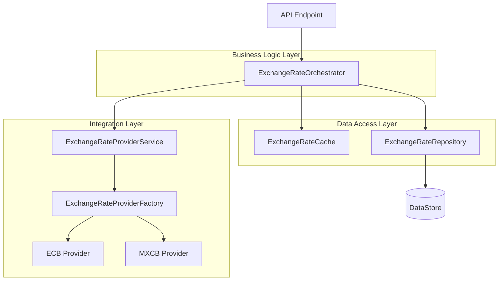
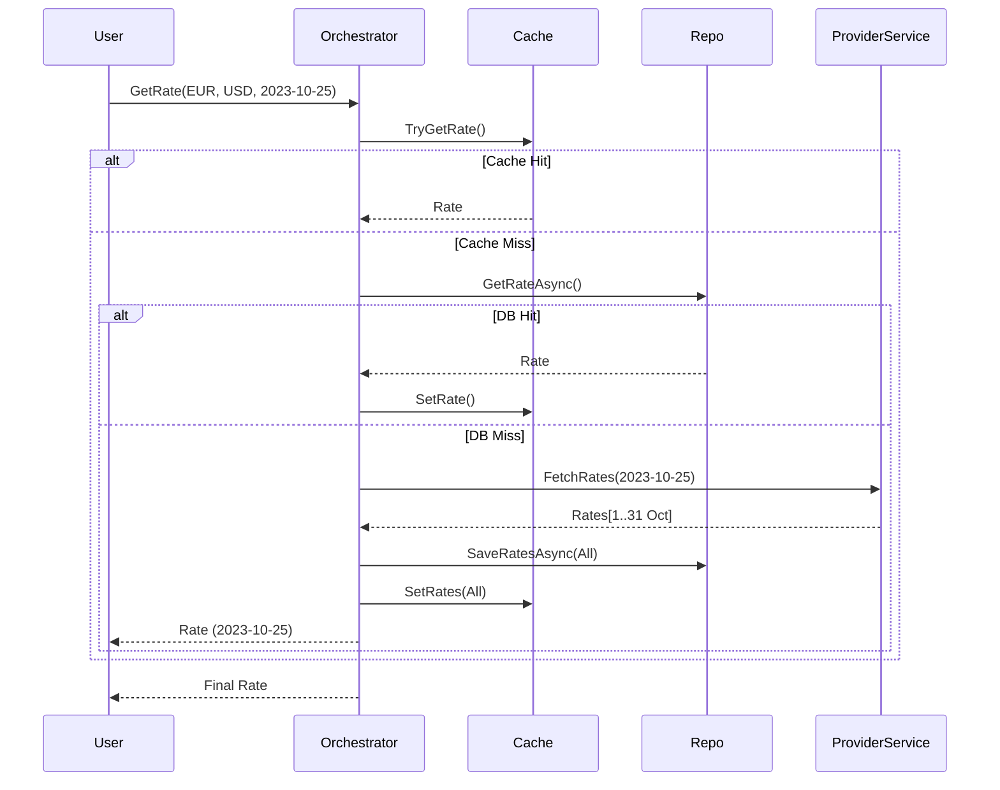

# Architecture Overview

## Executive Summary
The `ExchangeRate` service has been refactored from a monolithic "God Class" (`ExchangeRateRepository`) into a modular, layered architecture. This change separates concerns, improves testability, ensures thread safety, and optimizes external API usage.

## Architectural Diagram

## Component Responsibilities

### 1. Orchestrator (`ExchangeRateOrchestrator`)
**Role**: The "Brain" of the operation.
- **Entry Point**: All rate requests flow through here.
- **Business Logic**:
    - **Cross-Rate Calculation**: Computes rates between non-base currencies (e.g., GBP -> USD via EUR).
    - **Quote Type Handling**: Adjusts rates based on Direct/Indirect quotes.
    - **Fallback Logic**: Handles missing dates (Lookback) and future dates (Fetch Today).
    - **Hierarchy**: Checks Cache -> DB -> Provider.

### 2. Provider Service (`ExchangeRateProviderService`)
**Role**: The "Gateway" to external data.
- **Optimization ("Smart Fetch")**: When a single date is requested, it fetches **the entire month** of data from the provider. This minimizes HTTP calls for sequential requests.
- **Abstraction**: Hides the complexity of calling different providers.

### 3. Cache (`ExchangeRateCache`)
**Role**: The "Speed Layer".
- **Thread Safety**: Implemented using `ConcurrentDictionary` to handle high-concurrency read/write scenarios.
- **Key Features**: Tracks `MinDate` to optimize lookback loops for missing data.

### 4. Repository (`ExchangeRateRepository`)
**Role**: The "Persistence Layer".
- **Changes**: Stripped of all business logic. Now purely handles CRUD operations (Get/Save) to the `IExchangeRateDataStore`.

### 5. API Layer (`ExchangeRateEndpoints`)
**Role**: The "Interface".
- **Changes**: Extracted logical endpoints from `Program.cs` into a dedicated definition class.

## Key Flows

### Fetching a Rate

## Design Decisions
1.  **Decomposition**: Breaking the monolith allows independent testing of "Orchestration" (Business Rules) vs "Fetching" (Integration).
2.  **Stateless Components**: Services are registered as Singletons, promoting efficiency and forcing thread-safe designs.
3.  **Optimization First**: The "Fetch Month" strategy was chosen over "Fetch Day" to reduce latency and API quotas for typical use cases (generating reports, filling history).
4.  **Resilience**: The system gracefully handles future dates (by using the latest available data) and holidays (by looking back).
5.  **Factory Refactoring**: Switched `ExchangeRateProviderFactory` from `Reflection`-based instantiation to a `Dictionary`-based lookup. This improves performance (no runtime reflection cost) and type safety (compile-time checking of providers).
